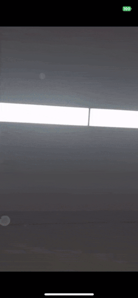
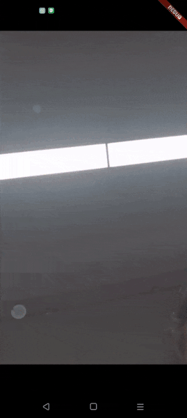

# zego_pip

基于 `zego_express_engine` 的 Flutter Picture-in-Picture (PIP) 插件，支持 iOS 和 Android 平台。

[English](README.md) | [中文](README_CN.md)

## 效果展示

### iOS 平台效果



### Android 平台效果



## 功能特性

- 🎥 **跨平台支持**: 支持 iOS 15.0+ 和 Android 8.0+
- 🚀 **开箱即用**: 零配置，一键启用 PIP 功能
- 🔄 **自动切换**: 智能处理 PIP 模式切换
- 🎯 **性能优化**: 内置视频渲染优化和内存管理

## 安装

### 1. 添加依赖

在 `pubspec.yaml` 中添加：

```yaml
dependencies:
  flutter:
    sdk: flutter
  zego_pip: ^0.0.1
  zego_express_engine: ^3.21.0
```

### 2. 安装依赖

```bash
flutter pub get
```

### 3. iOS 配置

在 `ios/Podfile` 中设置最低版本：

```ruby
platform :ios, '13.0'
```

然后运行：

```bash
cd ios
pod install
cd ..
```

### 4. Android 配置

确保 `android/app/build.gradle` 中的 `minSdkVersion` 至少为 21：

```gradle
android {
    defaultConfig {
        minSdkVersion 21
    }
}
```

在 `android/app/src/main/AndroidManifest.xml` 中的 `<activity>` 标签添加 `android:supportsPictureInPicture="true"`：

```xml
<manifest>
  <application>
    <activity
      android:name=".MainActivity"
      android:supportsPictureInPicture="true"
      ...
    />
  </application>
</manifest>
```

#### Android 权限说明

插件会自动添加以下必要权限到您的应用中：

| 权限类别               | 权限名称                                                   | 用途说明                        | 最低版本要求 |
| ---------------------- | ---------------------------------------------------------- | ------------------------------- | ------------ |
| **网络权限**     | `android.permission.INTERNET`                            | 网络访问权限，用于视频流传输    | Android 1.0  |
|                        | `android.permission.ACCESS_NETWORK_STATE`                | 网络状态访问权限                | Android 1.0  |
|                        | `android.permission.ACCESS_WIFI_STATE`                   | WiFi状态访问权限                | Android 1.0  |
| **音频权限**     | `android.permission.RECORD_AUDIO`                        | 录音权限，用于音频采集          | Android 1.0  |
|                        | `android.permission.MODIFY_AUDIO_SETTINGS`               | 修改音频设置权限                | Android 1.0  |
| **摄像头权限**   | `android.permission.CAMERA`                              | 摄像头权限，用于视频采集        | Android 1.0  |
| **前台服务权限** | `android.permission.FOREGROUND_SERVICE`                  | 前台服务权限，用于后台PIP功能   | Android 8.0  |
|                        | `android.permission.FOREGROUND_SERVICE_MICROPHONE`       | 前台服务麦克风权限              | Android 14   |
|                        | `android.permission.FOREGROUND_SERVICE_MEDIA_PROJECTION` | 前台服务媒体投影权限            | Android 14   |
| **系统权限**     | `android.permission.SYSTEM_ALERT_WINDOW`                 | 系统悬浮窗权限，用于PIP窗口显示 | Android 1.0  |

## 快速开始

### 1. 初始化

#### 方式一：zego_pip 内部创建引擎

```dart
import 'package:zego_pip/zego_pip.dart';

Future<void> main() async {
  WidgetsFlutterBinding.ensureInitialized();

  await ZegoPIP().init(
    /// zego_pip 内部创建 express engine，监听事件，并登录房间
    expressConfig: ZegoPIPExpressConfig(
      create: ZegoPIPExpressCreateConfig(
        // 请填写您自己的 app id
        appID: 1234567890,
        // 请填写您自己的 app sign
        appSign: 'your_app_sign_here',
      ),
      room: ZegoPIPExpressRoomConfig(
        // 请填写您自己的房间 id
        roomID: 'test_room_id',
        // 请填写您自己的房间登录用户信息
        userID: 'test_user_id',
        userName: 'test_user_name',
      ),
    ),
  );

  runApp(
    const MaterialApp(
      home: Scaffold(
        // 请填写您自己的流 id
        body: Center(child: ZegoPIPVideoView(streamID: 'test_stream_id')),
      ),
    ),
  );
}
```

#### 方式二：外部创建引擎（推荐）

```dart
import 'package:flutter/material.dart';
import 'dart:async';
import 'package:zego_express_engine/zego_express_engine.dart';
import 'package:zego_pip/zego_pip.dart';

Future<void> main() async {
  WidgetsFlutterBinding.ensureInitialized();

  await ZegoExpressManager().init();

  /// 在 ZegoPIP.init 之前，必须先创建 express engine
  await ZegoPIP().init(
    expressConfig: ZegoPIPExpressConfig(
      event: ZegoExpressManager().pipExpressEvent,
    ),
  );

  /// ZegoPIPVideoView 只能在从应用其他部分登录房间后才能渲染
  await ZegoExpressManager().loginRoom();

  runApp(
    const MaterialApp(
      home: Scaffold(
        /// 请填写您自己的流 id
        body: Center(child: ZegoPIPVideoView(streamID: 'test_stream_id')),
      ),
    ),
  );
}

class ZegoExpressManager {
  factory ZegoExpressManager() {
    return shared;
  }

  static final ZegoExpressManager shared = ZegoExpressManager._internal();
  ZegoExpressManager._internal();

  var pipExpressEvent = ZegoPIPExpressEvent();

  Future<void> init() async {
    ZegoExpressEngine.onEngineStateUpdate = onEngineStateUpdate;
    ZegoExpressEngine.onDebugError = onDebugError;
    ZegoExpressEngine.onRoomStreamUpdate = onRoomStreamUpdate;
    ZegoExpressEngine.onRoomStateChanged = onRoomStateChanged;
    ZegoExpressEngine.onPlayerStateUpdate = onPlayerStateUpdate;
    ZegoExpressEngine.onRemoteCameraStateUpdate = onRemoteCameraStateUpdate;
    ZegoExpressEngine.onRemoteMicStateUpdate = onRemoteMicStateUpdate;

    await ZegoExpressEngine.createEngineWithProfile(
      ZegoEngineProfile(
        1234567890,
        ZegoScenario.Default,
        appSign: 'your app sign',
        /// 请确保 `enablePlatformView` 设置为 true
        enablePlatformView: true,
      ),
    );
  }

  Future<bool> loginRoom() async {
    final result = await ZegoExpressEngine.instance.loginRoom(
      /// 请填写您自己的房间 id
      'test_room_id',
      ZegoUser(
        /// 请填写您自己的房间登录用户信息
        'test_user_id',
        'test_user_name',
      ),
      config: ZegoRoomConfig(0, true, ''),
    );

    return 0 == result.errorCode;
  }

  /// 转发express event给zego_pip
  void onEngineStateUpdate(ZegoEngineState state) {
    pipExpressEvent.onEngineStateUpdate?.call(state);
  }

  void onDebugError(int errorCode, String funcName, String info) {
    pipExpressEvent.onDebugError?.call(errorCode, funcName, info);
  }

  void onRoomStreamUpdate(
    String roomID,
    ZegoUpdateType updateType,
    List<ZegoStream> streamList,
    Map<String, dynamic> extendedData,
  ) {
    pipExpressEvent.onRoomStreamUpdate?.call(
      roomID,
      updateType,
      streamList,
      extendedData,
    );
  }

  void onRoomStateChanged(
    String roomID,
    ZegoRoomStateChangedReason reason,
    int errorCode,
    Map<String, dynamic> extendedData,
  ) {
    pipExpressEvent.onRoomStateChanged?.call(
      roomID,
      reason,
      errorCode,
      extendedData,
    );
  }

  void onPlayerStateUpdate(
    String streamID,
    ZegoPlayerState state,
    int errorCode,
    Map<String, dynamic> extendedData,
  ) {
    pipExpressEvent.onPlayerStateUpdate?.call(
      streamID,
      state,
      errorCode,
      extendedData,
    );
  }

  void onRemoteCameraStateUpdate(String streamID, ZegoRemoteDeviceState state) {
    pipExpressEvent.onRemoteCameraStateUpdate?.call(streamID, state);
  }

  void onRemoteMicStateUpdate(String streamID, ZegoRemoteDeviceState state) {
    pipExpressEvent.onRemoteMicStateUpdate?.call(streamID, state);
  }
}
```

### 2. 使用视频组件

```dart
class VideoPage extends StatelessWidget {
  @override
  Widget build(BuildContext context) {
    return Scaffold(
      appBar: AppBar(title: Text('Video Room')),
      body: ZegoPIPVideoView(
        streamID: 'stream_id',
        // PIP 功能自动启用
      ),
    );
  }
}
```

### 3. 手动控制 PIP（可选)

```dart
class PIPController {
  final zegoPIP = ZegoPIP();
  
  // 启用 PIP
  Future<void> enablePIP() async {
    await zegoPIP.enable();
  }
  
  // 更新 PIP 源
  Future<void> updatePIPSource(String streamID) async {
    await zegoPIP.updateIOSPIPSource(streamID);
  }
  
  // 停止 PIP
  Future<bool> stopPIP() async {
    return await zegoPIP.stopPIP();
  }
  
  // 检查是否在 PIP 模式
  Future<bool> isInPIP() async {
    return await zegoPIP.isInPIP();
  }
}
```

📖 **[API 文档](https://pub.dev/documentation/zego_pip/latest/topics/APIs-topic.html)**

## 平台支持

### iOS

- **最低版本**: iOS 13.0
- **PIP 支持**: iOS 15.0+
- **特性**: 原生 AVPictureInPictureController 支持

### Android

- **最低版本**: Android 8.0 (API 26)
- **PIP 支持**: Android 8.0+
- **特性**: 原生 PictureInPicture 模式支持

## 常见问题

### Q: 为什么 PIP 功能不工作？

A: 请检查：

1. 是否正确初始化了插件
2. iOS 版本是否支持 PIP (iOS 15.0+)
3. Android 版本是否支持 PIP (Android 8.0+)
4. 是否添加了 `zego_express_engine` 依赖

### Q: 如何处理 PIP 模式切换？

A: 插件会自动处理模式切换，您无需手动处理。

### Q: 如何自定义 PIP 界面？

- android: 可以把ZegoPIPVideoView当做普通Widget嵌套。
- iOS: 使用系统默认的 PIP 界面，暂不支持自定义。

## 已知bug

- 对端流未开启摄像头，此时渲染ZegoPIPVideoView，当对端流开启摄像头后，第一次的桌面最小化会不展示PIP窗口

## 贡献

欢迎提交 Issue 和 Pull Request！

## 许可证

本项目采用 MIT 许可证。
