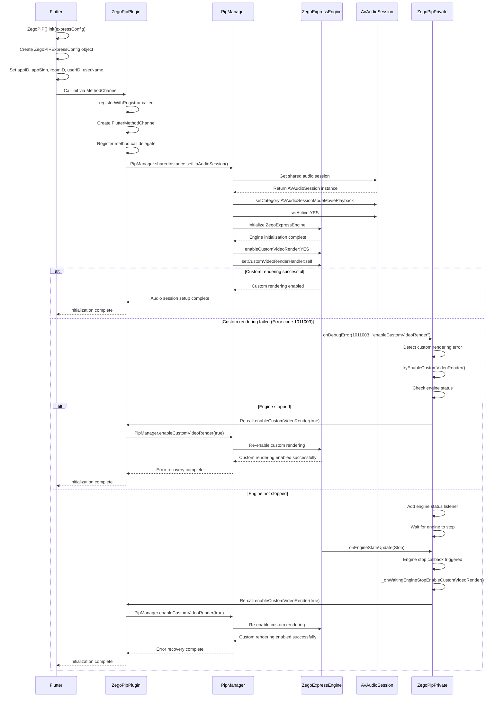
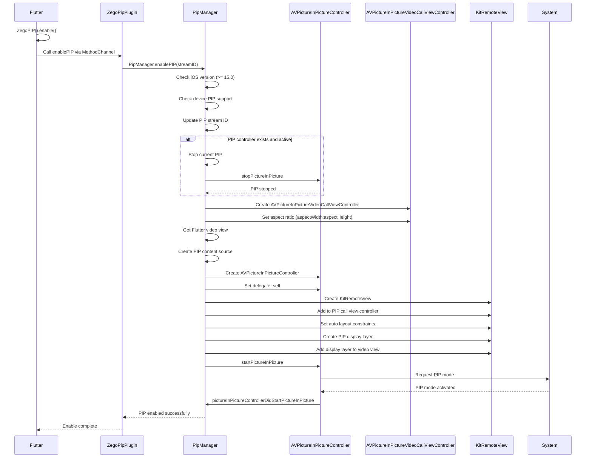
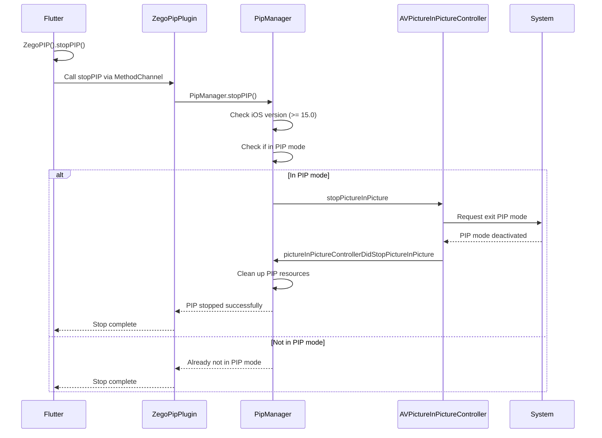
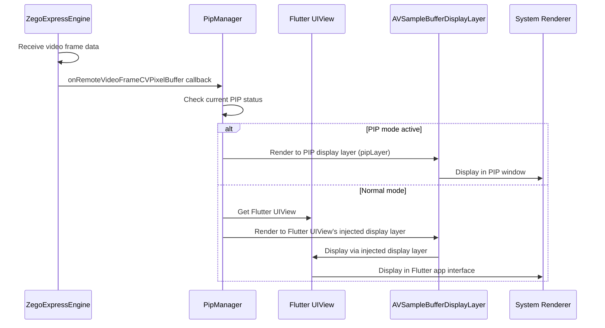
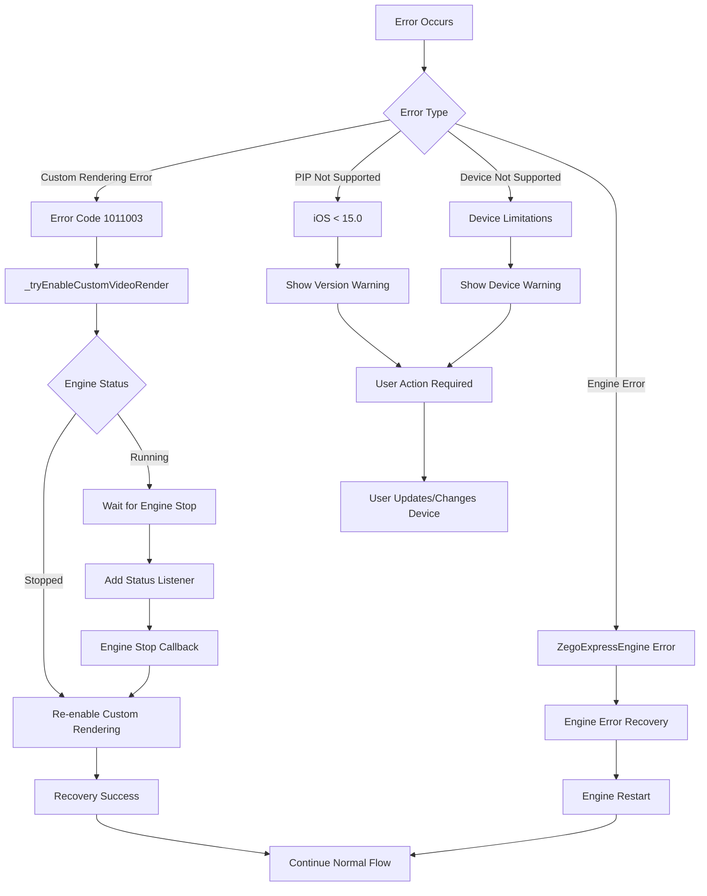
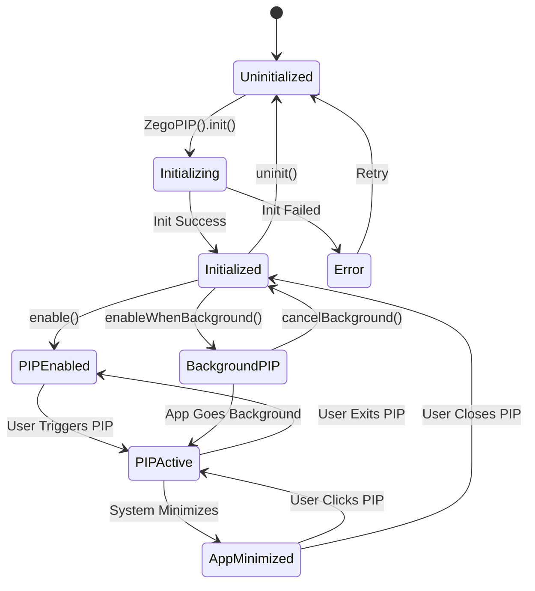
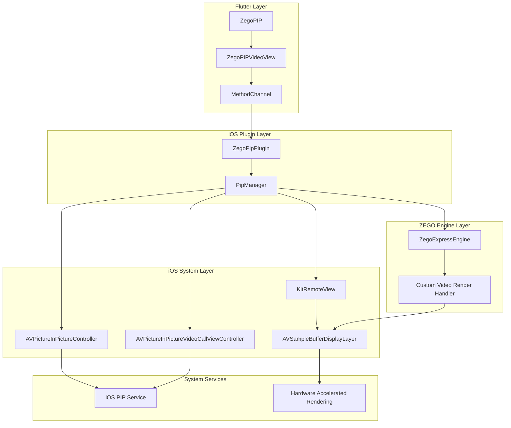

# iOS PIP Detailed Flow Diagram

[English](PIP_FLOW_DIAGRAM.md) | [中文](PIP_FLOW_DIAGRAM_CN.md)

## Complete Flow Overview

```mermaid
graph TD
    A[Flutter: ZegoPIP().init()] --> B[Flutter: Create ZegoPIPExpressConfig]
    B --> C[Flutter: Call Platform Channel]
    C --> D[iOS: ZegoPipPlugin.registerWithRegistrar]
    D --> E[iOS: Create MethodChannel]
    E --> F[iOS: PipManager.setUpAudioSession]
    F --> G[iOS: Initialize ZegoExpressEngine]
    G --> H[iOS: Enable Custom Video Rendering]
    H --> I[Flutter: Initialization Complete]
  
    I --> J[Flutter: ZegoPIPVideoView Creation]
    J --> K[Flutter: Call enable]
    K --> L[iOS: PipManager.enable]
    L --> M[iOS: Create AVPictureInPictureVideoCallViewController]
    M --> N[iOS: Create AVPictureInPictureController]
    N --> O[iOS: Set Delegate and Content Source]
    O --> P[iOS: Create KitRemoteView and Display Layer]
    P --> Q[iOS: Configure Auto Layout Constraints]
    Q --> R[iOS: PIP Ready]
  
    R --> S[User: Trigger PIP Mode]
    S --> T[iOS: pipController.startPictureInPicture]
    T --> U[iOS: System Enters PIP Mode]
    U --> V[iOS: App Minimizes to Desktop]
    V --> W[iOS: PIP Window Displays]
  
    W --> X[User: Click PIP Window]
    X --> Y[iOS: System Exits PIP Mode]
    Y --> Z[iOS: App Returns to Foreground]
    Z --> AA[iOS: Video Continues Playing]
    AA --> BB[User: Normal App Usage]
```

## Detailed Initialization Flow



## PIP Enable Flow



## PIP Disable Flow



## Video Rendering Flow



## Error Handling Flow



## State Management Flow



## Key Components Interaction



## Performance Optimization Points

### 1. **Memory Management**
- **Display Layer Reuse**: Reuse `AVSampleBufferDisplayLayer` instances
- **Buffer Pool**: Implement video buffer pooling
- **Resource Cleanup**: Proper cleanup when PIP is disabled

### 2. **Rendering Optimization**
- **Hardware Acceleration**: Use `AVSampleBufferDisplayLayer` for hardware acceleration
- **Frame Dropping**: Implement intelligent frame dropping for smooth playback
- **Resolution Scaling**: Dynamic resolution adjustment based on PIP window size

### 3. **Audio Session Management**
- **Background Audio**: Proper audio session configuration for background playback
- **Audio Interruption**: Handle audio interruption gracefully
- **Volume Control**: Maintain audio volume consistency

### 4. **Error Recovery**
- **Automatic Retry**: Implement automatic retry mechanisms
- **Graceful Degradation**: Fallback to normal mode if PIP fails
- **State Synchronization**: Keep Flutter and iOS states synchronized

## Debugging and Monitoring

### 1. **Log Points**
```objc
// Key logging points in PipManager.m
NSLog(@"[PipManager] PIP enabled for stream: %@", streamID);
NSLog(@"[PipManager] Custom rendering enabled: %@", isEnabled ? @"YES" : @"NO");
NSLog(@"[PipManager] PIP state changed: %ld", (long)state);
```

### 2. **State Monitoring**
- **PIP State**: Monitor `AVPictureInPictureController` state changes
- **Engine State**: Track `ZegoExpressEngine` status
- **Rendering State**: Monitor video rendering performance

### 3. **Performance Metrics**
- **Frame Rate**: Monitor video frame rendering rate
- **Memory Usage**: Track memory consumption
- **CPU Usage**: Monitor CPU utilization during PIP mode

## Best Practices

### 1. **Initialization Order**
1. Initialize Flutter binding
2. Initialize ZegoPIP with proper configuration
3. Create video views after initialization
4. Enable PIP functionality

### 2. **Error Handling**
1. Always check iOS version compatibility
2. Implement proper error recovery mechanisms
3. Provide user-friendly error messages
4. Log errors for debugging

### 3. **Resource Management**
1. Clean up resources when PIP is disabled
2. Handle app lifecycle changes properly
3. Manage audio session appropriately
4. Monitor memory usage

### 4. **User Experience**
1. Provide smooth transitions between modes
2. Maintain video quality in PIP mode
3. Handle user interactions gracefully
4. Provide clear feedback for state changes
