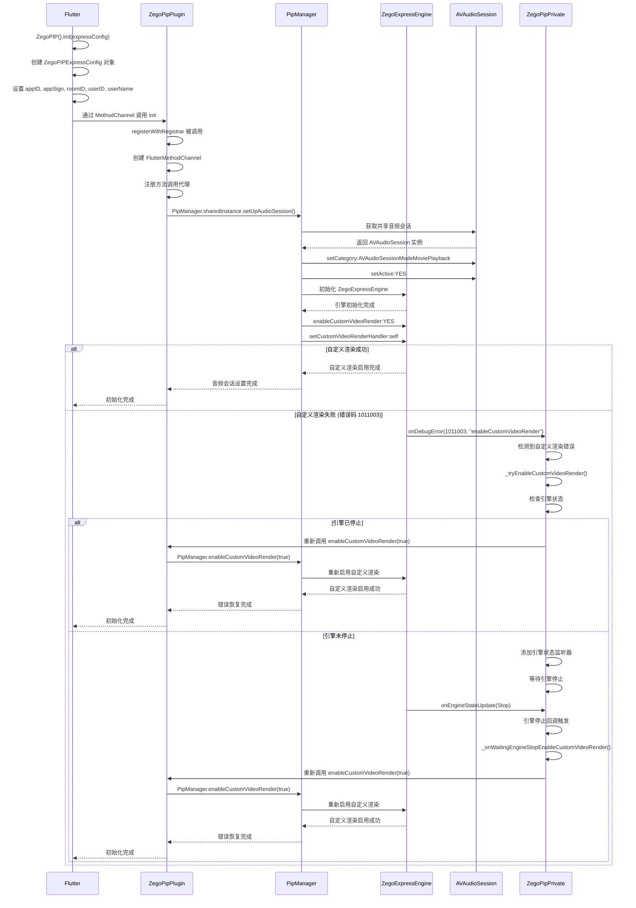
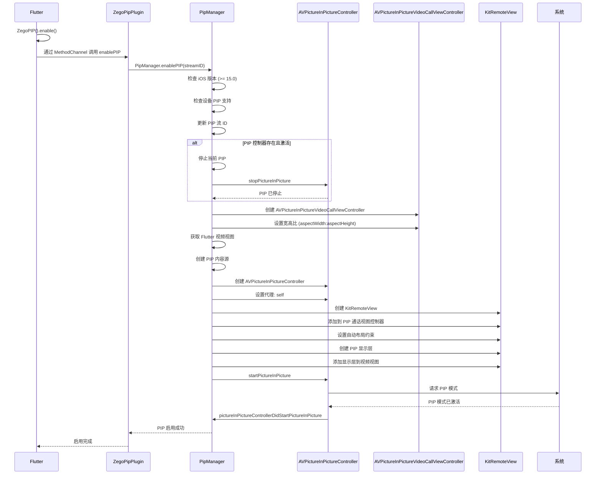
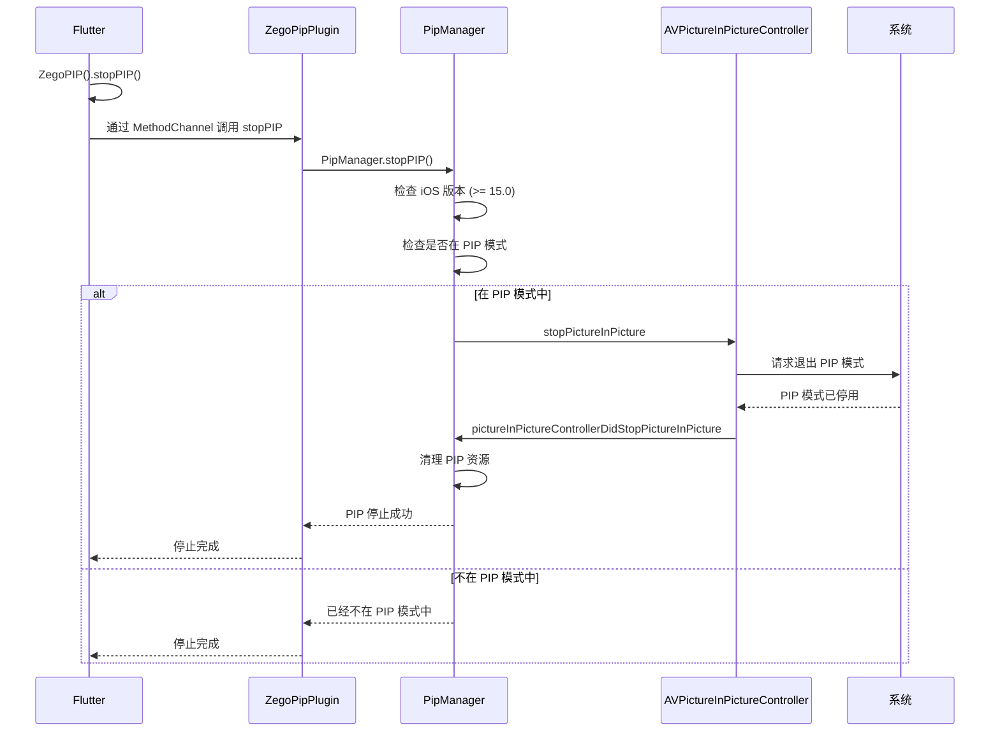
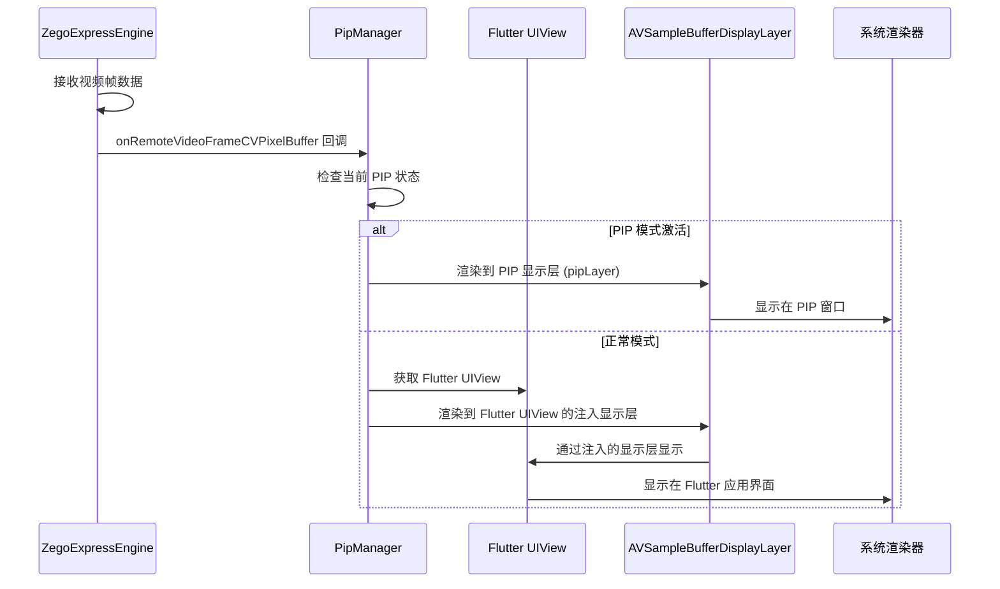
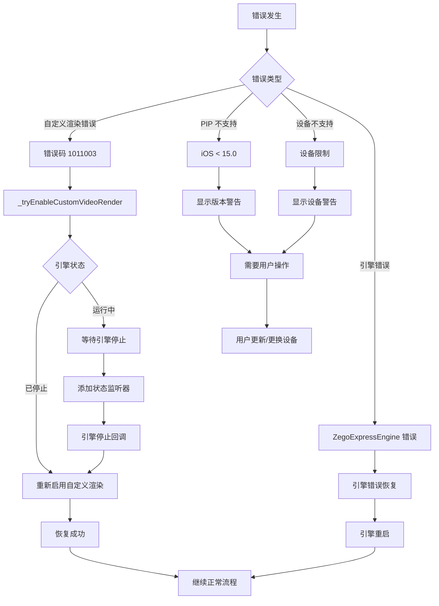
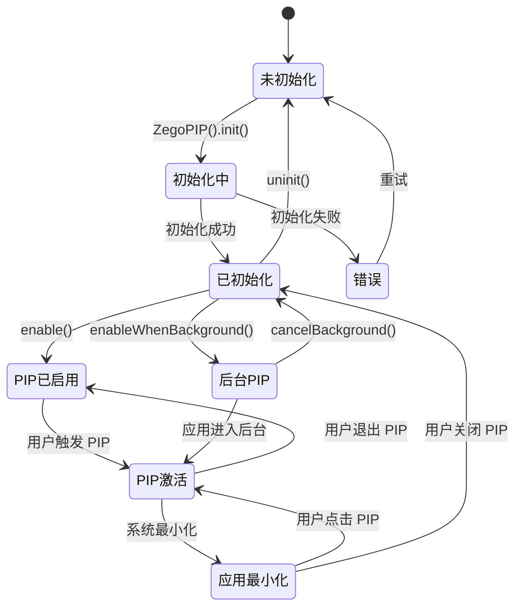
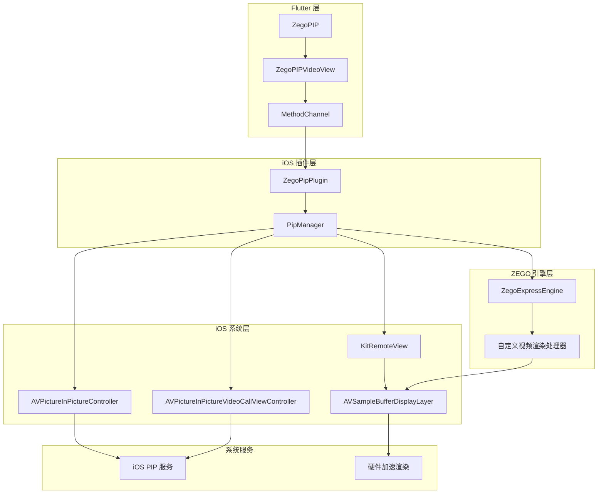

# iOS PIP 详细流程图

[English](PIP_FLOW_DIAGRAM.md) | [中文](PIP_FLOW_DIAGRAM_CN.md)

## 完整流程概览

```mermaid
graph TD
    A[Flutter: ZegoPIP().init()] --> B[Flutter: 创建 ZegoPIPExpressConfig]
    B --> C[Flutter: 调用平台通道]
    C --> D[iOS: ZegoPipPlugin.registerWithRegistrar]
    D --> E[iOS: 创建 MethodChannel]
    E --> F[iOS: PipManager.setUpAudioSession]
    F --> G[iOS: 初始化 ZegoExpressEngine]
    G --> H[iOS: 启用自定义视频渲染]
    H --> I[Flutter: 初始化完成]
  
    I --> J[Flutter: ZegoPIPVideoView 创建]
    J --> K[Flutter: 调用 enable]
    K --> L[iOS: PipManager.enable]
    L --> M[iOS: 创建 AVPictureInPictureVideoCallViewController]
    M --> N[iOS: 创建 AVPictureInPictureController]
    N --> O[iOS: 设置代理和内容源]
    O --> P[iOS: 创建 KitRemoteView 和显示层]
    P --> Q[iOS: 配置自动布局约束]
    Q --> R[iOS: PIP 准备就绪]
  
    R --> S[用户: 触发 PIP 模式]
    S --> T[iOS: pipController.startPictureInPicture]
    T --> U[iOS: 系统进入 PIP 模式]
    U --> V[iOS: 应用最小化到桌面]
    V --> W[iOS: PIP 窗口显示]
  
    W --> X[用户: 点击 PIP 窗口]
    X --> Y[iOS: 系统退出 PIP 模式]
    Y --> Z[iOS: 应用恢复前台]
    Z --> AA[iOS: 视频继续播放]
    AA --> BB[用户: 正常使用应用]
```

## 详细初始化流程



## PIP 启用流程



## PIP 禁用流程



## 视频渲染流程



## 错误处理流程



## 状态管理流程



## 关键组件交互



## 性能优化要点

### 1. **内存管理**
- **显示层复用**: 复用 `AVSampleBufferDisplayLayer` 实例
- **缓冲区池**: 实现视频缓冲区池
- **资源清理**: PIP 禁用时正确清理资源

### 2. **渲染优化**
- **硬件加速**: 使用 `AVSampleBufferDisplayLayer` 进行硬件加速
- **帧丢弃**: 实现智能帧丢弃以保持流畅播放
- **分辨率缩放**: 根据 PIP 窗口大小动态调整分辨率

### 3. **音频会话管理**
- **后台音频**: 为后台播放正确配置音频会话
- **音频中断**: 优雅处理音频中断
- **音量控制**: 保持音频音量一致性

### 4. **错误恢复**
- **自动重试**: 实现自动重试机制
- **优雅降级**: 如果 PIP 失败则回退到正常模式
- **状态同步**: 保持 Flutter 和 iOS 状态同步

## 调试和监控

### 1. **日志点**
```objc
// PipManager.m 中的关键日志点
NSLog(@"[PipManager] PIP 已为流启用: %@", streamID);
NSLog(@"[PipManager] 自定义渲染已启用: %@", isEnabled ? @"YES" : @"NO");
NSLog(@"[PipManager] PIP 状态已更改: %ld", (long)state);
```

### 2. **状态监控**
- **PIP 状态**: 监控 `AVPictureInPictureController` 状态变化
- **引擎状态**: 跟踪 `ZegoExpressEngine` 状态
- **渲染状态**: 监控视频渲染性能

### 3. **性能指标**
- **帧率**: 监控视频帧渲染率
- **内存使用**: 跟踪内存消耗
- **CPU 使用**: 监控 PIP 模式下的 CPU 利用率

## 最佳实践

### 1. **初始化顺序**
1. 初始化 Flutter binding
2. 使用正确配置初始化 ZegoPIP
3. 初始化后创建视频视图
4. 启用 PIP 功能

### 2. **错误处理**
1. 始终检查 iOS 版本兼容性
2. 实现正确的错误恢复机制
3. 提供用户友好的错误消息
4. 记录错误以便调试

### 3. **资源管理**
1. PIP 禁用时清理资源
2. 正确处理应用生命周期变化
3. 适当管理音频会话
4. 监控内存使用

### 4. **用户体验**
1. 提供模式之间的平滑过渡
2. 在 PIP 模式下保持视频质量
3. 优雅处理用户交互
4. 为状态变化提供清晰的反馈 