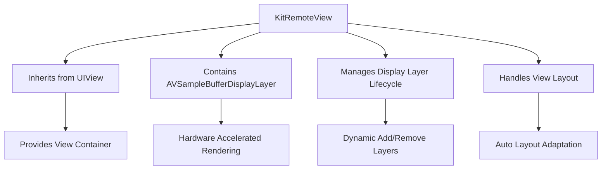
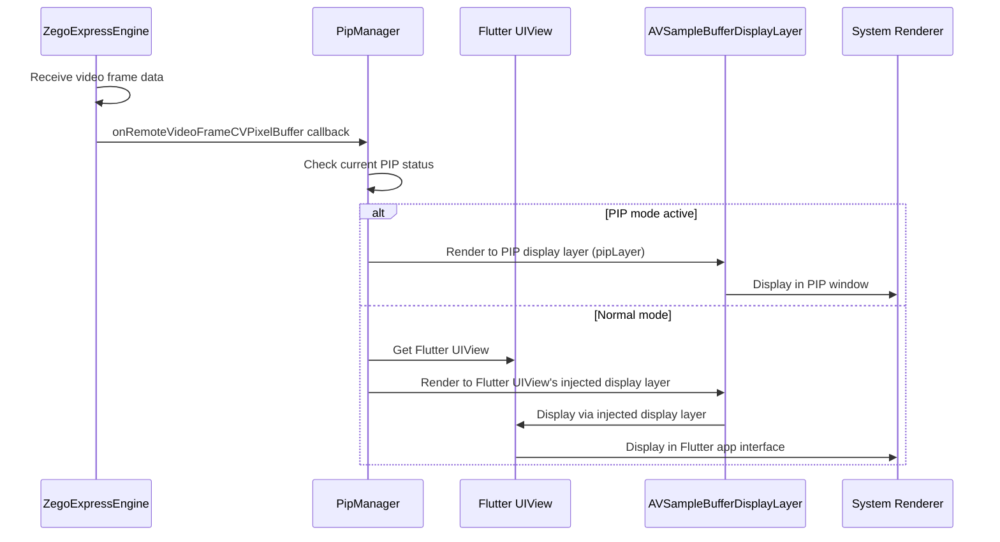
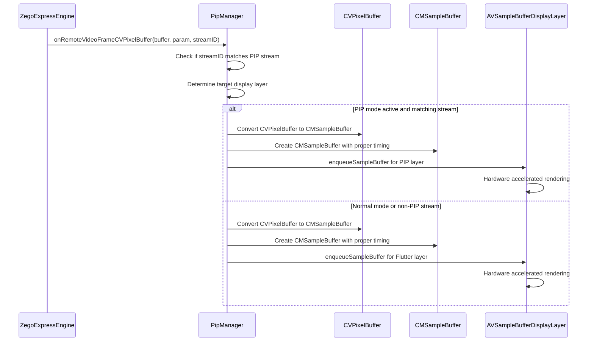

# iOS Video Rendering Flow Detailed

[English](VIDEO_RENDERING_FLOW.md) | [中文](VIDEO_RENDERING_FLOW_CN.md)

## KitRemoteView Component Details

### What is KitRemoteView?

`KitRemoteView` is a custom iOS video display component specifically designed for displaying remote video streams in PIP mode. It is the core display container in the entire video rendering flow.

### KitRemoteView Architecture Design



### Core Functions of KitRemoteView

#### 1. **Video Display Container**
```objc
@interface KitRemoteView : UIView
@property(nonatomic, strong) AVSampleBufferDisplayLayer *displayLayer;
@end
```

- **Inherits from UIView**: Provides standard iOS view functionality
- **Contains displayLayer**: Manages `AVSampleBufferDisplayLayer` for video rendering
- **View Management**: Handles view creation, layout, and destruction

#### 2. **Display Layer Management**
```objc
- (void)addDisplayLayer:(AVSampleBufferDisplayLayer *)layer {
    [self.layer addSublayer:layer];
    self.displayLayer = layer;
}
```

- **Dynamic Layer Addition**: Supports runtime addition of different display layers
- **Layer Reference Management**: Maintains strong reference to current display layer
- **View Hierarchy Management**: Adds display layer to view's layer hierarchy

#### 3. **Auto Layout Support**
```objc
- (void)layoutSubviews {
    [super layoutSubviews];
    self.displayLayer.frame = self.bounds;
}
```

- **Responsive Layout**: Automatically adjusts display layer when view size changes
- **Boundary Adaptation**: Ensures display layer always fills view bounds
- **Layout Consistency**: Maintains synchronization between display layer and view

## Complete Video Rendering Flow

### 1. Video Data Flow Path



### 2. Key Configuration

```objc
// Key configuration in PipManager.m
ZegoCustomVideoRenderConfig *renderConfig = [[ZegoCustomVideoRenderConfig alloc] init];
renderConfig.bufferType = ZegoVideoBufferTypeCVPixelBuffer;  // Use CVPixelBuffer type
renderConfig.frameFormatSeries = ZegoVideoFrameFormatSeriesRGB;  // Use RGB format

[[ZegoExpressEngine sharedEngine] enableCustomVideoRender:YES config:renderConfig];
```

### 3. KitRemoteView Usage in PIP

```objc
// Create KitRemoteView for PIP
KitRemoteView *pipVideoView = [[KitRemoteView alloc] initWithFrame:CGRectZero];

// Create display layer for PIP
AVSampleBufferDisplayLayer *pipLayer = [[AVSampleBufferDisplayLayer alloc] init];
pipLayer.videoGravity = AVLayerVideoGravityResizeAspect;

// Add display layer to KitRemoteView
[pipVideoView addDisplayLayer:pipLayer];

// Set auto layout constraints
pipVideoView.translatesAutoresizingMaskIntoConstraints = NO;
[pipCallVC.view addSubview:pipVideoView];

[NSLayoutConstraint activateConstraints:@[
    [pipVideoView.topAnchor constraintEqualToAnchor:pipCallVC.view.topAnchor],
    [pipVideoView.leadingAnchor constraintEqualToAnchor:pipCallVC.view.leadingAnchor],
    [pipVideoView.trailingAnchor constraintEqualToAnchor:pipCallVC.view.trailingAnchor],
    [pipVideoView.bottomAnchor constraintEqualToAnchor:pipCallVC.view.bottomAnchor]
]];
```

## Video Frame Processing Flow

### 1. Frame Reception and Processing



### 2. CVPixelBuffer to CMSampleBuffer Conversion

```objc
- (CMSampleBufferRef)createSampleBufferFromPixelBuffer:(CVPixelBufferRef)pixelBuffer {
    // Validate input parameters
    if (!pixelBuffer) {
        return NULL;
    }
    
    // Set timing information as invalid, don't specify specific timestamp
    CMTime presentationTime = CMTimeMake(0, 1);
    
    // Create video format description to describe CVPixelBuffer format information
    CMVideoFormatDescriptionRef formatDescription = NULL;
    CMVideoFormatDescriptionCreateForImageBuffer(kCFAllocatorDefault, pixelBuffer, &formatDescription);
    
    if (!formatDescription) {
        return NULL;
    }
    
    // Create CMSampleBuffer from CVPixelBuffer
    CMSampleBufferRef sampleBuffer = NULL;
    CMSampleBufferCreateForImageBuffer(kCFAllocatorDefault, pixelBuffer, true, NULL, NULL, formatDescription, &presentationTime, &sampleBuffer);
    
    // Release video format description to avoid memory leaks
    CFRelease(formatDescription);
    
    // Set immediate display flag to ensure video frame can be rendered immediately
    if (sampleBuffer) {
        CMSampleBufferSetOutputPresentationTimeStamp(sampleBuffer, presentationTime);
    }
    
    return sampleBuffer;
}
```

### 3. Display Layer Management

```objc
- (void)updateDisplayLayerForView:(UIView *)view {
    // Validate input parameters
    if (!view) {
        return;
    }
    
    // Traverse all sublayers of UIView to find injected display layer
    for (CALayer *layer in view.layer.sublayers) {
        if ([layer isKindOfClass:[AVSampleBufferDisplayLayer class]]) {
            // Synchronize display layer frame size to ensure consistency with UIView
            layer.frame = view.bounds;
            break;
        }
    }
}
```

## Performance Optimization

### 1. **Hardware Acceleration**

```objc
// Enable hardware acceleration for display layer
AVSampleBufferDisplayLayer *displayLayer = [[AVSampleBufferDisplayLayer alloc] init];
displayLayer.videoGravity = AVLayerVideoGravityResizeAspect;

// Configure for optimal performance
displayLayer.needsDisplayOnBoundsChange = NO;
displayLayer.drawsAsynchronously = YES;
```

### 2. **Memory Management**

```objc
// Proper cleanup of display layers
- (void)cleanupDisplayLayer {
    if (self.displayLayer) {
        [self.displayLayer removeFromSuperlayer];
        self.displayLayer = nil;
    }
}

// Buffer pool management
- (void)reusePixelBuffer:(CVPixelBufferRef)buffer {
    // Return buffer to pool for reuse
    CVPixelBufferRelease(buffer);
}
```

### 3. **Frame Rate Control**

```objc
// Implement frame dropping for smooth playback
- (void)processVideoFrame:(CVPixelBufferRef)buffer {
    static CFTimeInterval lastFrameTime = 0;
    CFTimeInterval currentTime = CACurrentMediaTime();
    
    // Drop frames if too frequent (e.g., maintain 30fps)
    if (currentTime - lastFrameTime < 1.0/30.0) {
        return;
    }
    
    lastFrameTime = currentTime;
    [self renderFrame:buffer];
}
```

## Error Handling and Recovery

### 1. **Rendering Error Recovery**

```objc
- (void)handleRenderingError:(OSStatus)error {
    switch (error) {
        case -11847: // kCVReturnInvalidPixelFormat
            // Rebuild display layer
            [self rebuildDisplayLayer];
            break;
        case -11848: // kCVReturnInvalidSize
            // Update layer size
            [self updateLayerSize];
            break;
        default:
            // Log error and attempt recovery
            NSLog(@"Rendering error: %d", (int)error);
            [self attemptRecovery];
            break;
    }
}
```

### 2. **Display Layer Recovery**

```objc
- (void)rebuildDisplayLayer {
    // Remove old display layer
    [self.displayLayer removeFromSuperlayer];
    
    // Create new display layer
    AVSampleBufferDisplayLayer *newLayer = [[AVSampleBufferDisplayLayer alloc] init];
    newLayer.videoGravity = AVLayerVideoGravityResizeAspect;
    
    // Add new layer
    [self addDisplayLayer:newLayer];
    
    // Update reference
    self.displayLayer = newLayer;
}
```

## Integration with Flutter

### 1. **Platform View Integration**

```objc
// Get Flutter platform view
ZegoPlatformView *platformView = [[ZegoPlatformViewFactory sharedInstance] getPlatformView:viewID];
if (platformView) {
    UIView *flutterView = platformView.view;
    
    // Inject display layer into Flutter view
    [self injectDisplayLayerIntoFlutterView:flutterView];
}
```

### 2. **Display Layer Injection**

```objc
- (void)injectDisplayLayerIntoFlutterView:(UIView *)flutterView {
    // Create display layer
    AVSampleBufferDisplayLayer *displayLayer = [[AVSampleBufferDisplayLayer alloc] init];
    displayLayer.videoGravity = AVLayerVideoGravityResizeAspect;
    
    // Add to Flutter view's layer hierarchy
    [flutterView.layer addSublayer:displayLayer];
    
    // Set frame to match Flutter view
    displayLayer.frame = flutterView.bounds;
    
    // Store reference for later use
    self.flutterDisplayLayer = displayLayer;
}
```

## Debugging and Monitoring

### 1. **Performance Monitoring**

```objc
// Monitor frame rendering performance
- (void)monitorRenderingPerformance {
    static CFTimeInterval lastFrameTime = 0;
    CFTimeInterval currentTime = CACurrentMediaTime();
    
    if (lastFrameTime > 0) {
        CFTimeInterval frameInterval = currentTime - lastFrameTime;
        NSLog(@"Frame interval: %.3f ms", frameInterval * 1000);
    }
    
    lastFrameTime = currentTime;
}
```

### 2. **Memory Usage Monitoring**

```objc
// Monitor memory usage
- (void)monitorMemoryUsage {
    struct task_basic_info info;
    mach_msg_type_number_t size = TASK_BASIC_INFO_COUNT;
    kern_return_t kerr = task_info(mach_task_self(), TASK_BASIC_INFO, (task_info_t)&info, &size);
    
    if (kerr == KERN_SUCCESS) {
        NSLog(@"Memory usage: %.2f MB", info.resident_size / 1024.0 / 1024.0);
    }
}
```

## Best Practices

### 1. **Display Layer Management**
- Always check for nil before using display layers
- Properly clean up resources when views are destroyed
- Use weak references to avoid retain cycles
- Handle layer hierarchy changes gracefully

### 2. **Performance Optimization**
- Use hardware acceleration whenever possible
- Implement frame dropping for smooth playback
- Monitor memory usage and clean up unused buffers
- Optimize frame processing for different device capabilities

### 3. **Error Handling**
- Implement comprehensive error recovery mechanisms
- Log errors for debugging purposes
- Provide fallback rendering methods
- Handle edge cases gracefully

### 4. **Integration Guidelines**
- Follow Flutter platform view lifecycle
- Properly handle view size changes
- Maintain synchronization between Flutter and native states
- Test on various device configurations 