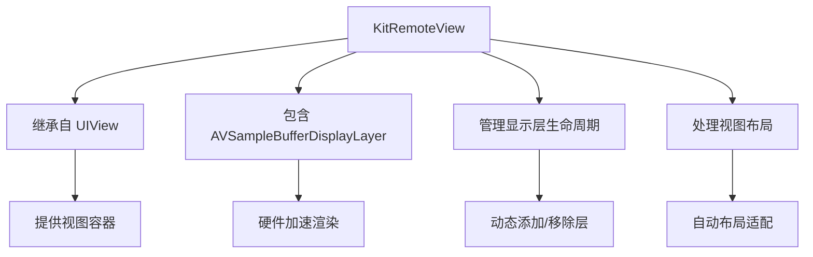
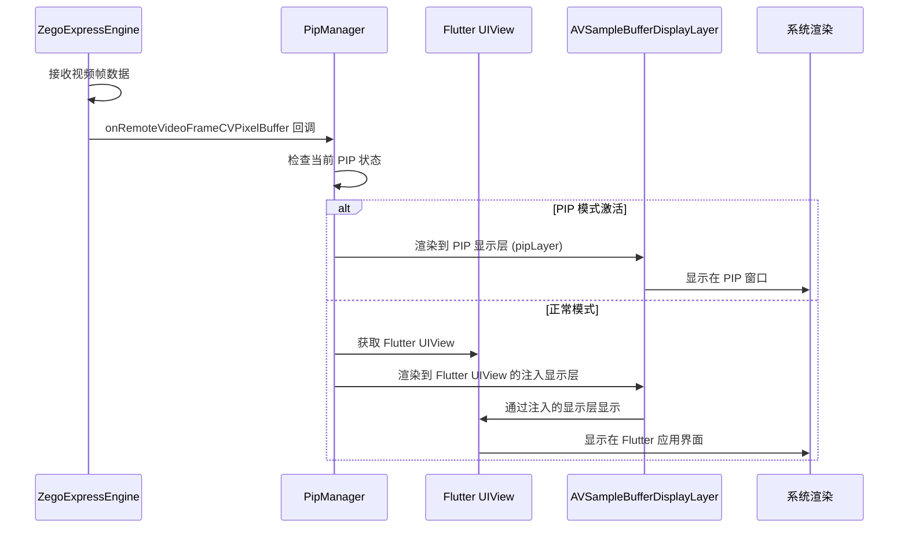
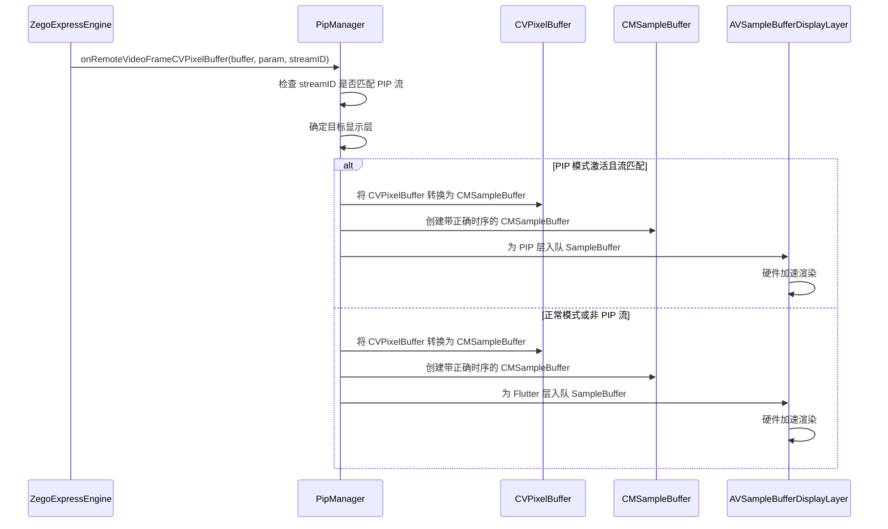

# iOS 视频渲染流程详解

[English](VIDEO_RENDERING_FLOW.md) | [中文](VIDEO_RENDERING_FLOW_CN.md)

## KitRemoteView 组件详解

### 什么是 KitRemoteView？

`KitRemoteView` 是一个自定义的 iOS 视频显示组件，专门用于在 PIP 模式下显示远程视频流。它是整个视频渲染流程中的核心显示容器。

### KitRemoteView 的架构设计



### KitRemoteView 的核心功能

#### 1. **视频显示容器**
```objc
@interface KitRemoteView : UIView
@property(nonatomic, strong) AVSampleBufferDisplayLayer *displayLayer;
@end
```

- **继承自 UIView**：提供标准的 iOS 视图功能
- **包含 displayLayer**：管理 `AVSampleBufferDisplayLayer` 用于视频渲染
- **视图管理**：处理视图的创建、布局和销毁

#### 2. **显示层管理**
```objc
- (void)addDisplayLayer:(AVSampleBufferDisplayLayer *)layer {
    [self.layer addSublayer:layer];
    self.displayLayer = layer;
}
```

- **动态添加层**：支持运行时添加不同的显示层
- **层引用管理**：维护对当前显示层的强引用
- **视图层次管理**：将显示层添加到视图的图层层次结构中

#### 3. **自动布局支持**
```objc
- (void)layoutSubviews {
    [super layoutSubviews];
    self.displayLayer.frame = self.bounds;
}
```

- **响应式布局**：当视图大小改变时自动调整显示层
- **边界适配**：确保显示层始终填满视图边界
- **布局一致性**：保持显示层与视图的同步

## 完整的视频渲染流程

### 1. 视频数据流路径



### 2. 关键配置

```objc
// 在 PipManager.m 中的关键配置
ZegoCustomVideoRenderConfig *renderConfig = [[ZegoCustomVideoRenderConfig alloc] init];
renderConfig.bufferType = ZegoVideoBufferTypeCVPixelBuffer;  // 使用 CVPixelBuffer 类型
renderConfig.frameFormatSeries = ZegoVideoFrameFormatSeriesRGB;  // 使用 RGB 格式

[[ZegoExpressEngine sharedEngine] enableCustomVideoRender:YES config:renderConfig];
```

### 3. KitRemoteView 在 PIP 中的使用

```objc
// 为 PIP 创建 KitRemoteView
KitRemoteView *pipVideoView = [[KitRemoteView alloc] initWithFrame:CGRectZero];

// 为 PIP 创建显示层
AVSampleBufferDisplayLayer *pipLayer = [[AVSampleBufferDisplayLayer alloc] init];
pipLayer.videoGravity = AVLayerVideoGravityResizeAspect;

// 将显示层添加到 KitRemoteView
[pipVideoView addDisplayLayer:pipLayer];

// 设置自动布局约束
pipVideoView.translatesAutoresizingMaskIntoConstraints = NO;
[pipCallVC.view addSubview:pipVideoView];

[NSLayoutConstraint activateConstraints:@[
    [pipVideoView.topAnchor constraintEqualToAnchor:pipCallVC.view.topAnchor],
    [pipVideoView.leadingAnchor constraintEqualToAnchor:pipCallVC.view.leadingAnchor],
    [pipVideoView.trailingAnchor constraintEqualToAnchor:pipCallVC.view.trailingAnchor],
    [pipVideoView.bottomAnchor constraintEqualToAnchor:pipCallVC.view.bottomAnchor]
]];
```

## 视频帧处理流程

### 1. 帧接收和处理



### 2. CVPixelBuffer 到 CMSampleBuffer 转换

```objc
- (CMSampleBufferRef)createSampleBufferFromPixelBuffer:(CVPixelBufferRef)pixelBuffer {
    // 验证输入参数
    if (!pixelBuffer) {
        return NULL;
    }
    
    // 设置时间信息为无效，不指定具体的时间戳
    CMTime presentationTime = CMTimeMake(0, 1);
    
    // 创建视频格式描述，用于描述 CVPixelBuffer 的格式信息
    CMVideoFormatDescriptionRef formatDescription = NULL;
    CMVideoFormatDescriptionCreateForImageBuffer(kCFAllocatorDefault, pixelBuffer, &formatDescription);
    
    if (!formatDescription) {
        return NULL;
    }
    
    // 从 CVPixelBuffer 创建 CMSampleBuffer
    CMSampleBufferRef sampleBuffer = NULL;
    CMSampleBufferCreateForImageBuffer(kCFAllocatorDefault, pixelBuffer, true, NULL, NULL, formatDescription, &presentationTime, &sampleBuffer);
    
    // 释放视频格式描述，避免内存泄漏
    CFRelease(formatDescription);
    
    // 设置立即显示标志，确保视频帧能够立即渲染
    if (sampleBuffer) {
        CMSampleBufferSetOutputPresentationTimeStamp(sampleBuffer, presentationTime);
    }
    
    return sampleBuffer;
}
```

### 3. 显示层管理

```objc
- (void)updateDisplayLayerForView:(UIView *)view {
    // 验证输入参数
    if (!view) {
        return;
    }
    
    // 遍历 UIView 的所有子层，查找注入的显示层
    for (CALayer *layer in view.layer.sublayers) {
        if ([layer isKindOfClass:[AVSampleBufferDisplayLayer class]]) {
            // 同步显示层的框架尺寸，确保与 UIView 保持一致
            layer.frame = view.bounds;
            break;
        }
    }
}
```

## 性能优化

### 1. **硬件加速**

```objc
// 为显示层启用硬件加速
AVSampleBufferDisplayLayer *displayLayer = [[AVSampleBufferDisplayLayer alloc] init];
displayLayer.videoGravity = AVLayerVideoGravityResizeAspect;

// 配置以获得最佳性能
displayLayer.needsDisplayOnBoundsChange = NO;
displayLayer.drawsAsynchronously = YES;
```

### 2. **内存管理**

```objc
// 正确清理显示层
- (void)cleanupDisplayLayer {
    if (self.displayLayer) {
        [self.displayLayer removeFromSuperlayer];
        self.displayLayer = nil;
    }
}

// 缓冲区池管理
- (void)reusePixelBuffer:(CVPixelBufferRef)buffer {
    // 将缓冲区返回到池中以供重用
    CVPixelBufferRelease(buffer);
}
```

### 3. **帧率控制**

```objc
// 实现帧丢弃以保持流畅播放
- (void)processVideoFrame:(CVPixelBufferRef)buffer {
    static CFTimeInterval lastFrameTime = 0;
    CFTimeInterval currentTime = CACurrentMediaTime();
    
    // 如果太频繁则丢弃帧（例如，保持 30fps）
    if (currentTime - lastFrameTime < 1.0/30.0) {
        return;
    }
    
    lastFrameTime = currentTime;
    [self renderFrame:buffer];
}
```

## 错误处理和恢复

### 1. **渲染错误恢复**

```objc
- (void)handleRenderingError:(OSStatus)error {
    switch (error) {
        case -11847: // kCVReturnInvalidPixelFormat
            // 重建显示层
            [self rebuildDisplayLayer];
            break;
        case -11848: // kCVReturnInvalidSize
            // 更新层大小
            [self updateLayerSize];
            break;
        default:
            // 记录错误并尝试恢复
            NSLog(@"渲染错误: %d", (int)error);
            [self attemptRecovery];
            break;
    }
}
```

### 2. **显示层恢复**

```objc
- (void)rebuildDisplayLayer {
    // 移除旧的显示层
    [self.displayLayer removeFromSuperlayer];
    
    // 创建新的显示层
    AVSampleBufferDisplayLayer *newLayer = [[AVSampleBufferDisplayLayer alloc] init];
    newLayer.videoGravity = AVLayerVideoGravityResizeAspect;
    
    // 添加新层
    [self addDisplayLayer:newLayer];
    
    // 更新引用
    self.displayLayer = newLayer;
}
```

## 与 Flutter 集成

### 1. **平台视图集成**

```objc
// 获取 Flutter 平台视图
ZegoPlatformView *platformView = [[ZegoPlatformViewFactory sharedInstance] getPlatformView:viewID];
if (platformView) {
    UIView *flutterView = platformView.view;
    
    // 将显示层注入到 Flutter 视图中
    [self injectDisplayLayerIntoFlutterView:flutterView];
}
```

### 2. **显示层注入**

```objc
- (void)injectDisplayLayerIntoFlutterView:(UIView *)flutterView {
    // 创建显示层
    AVSampleBufferDisplayLayer *displayLayer = [[AVSampleBufferDisplayLayer alloc] init];
    displayLayer.videoGravity = AVLayerVideoGravityResizeAspect;
    
    // 添加到 Flutter 视图的图层层次结构中
    [flutterView.layer addSublayer:displayLayer];
    
    // 设置框架以匹配 Flutter 视图
    displayLayer.frame = flutterView.bounds;
    
    // 存储引用以供后续使用
    self.flutterDisplayLayer = displayLayer;
}
```

## 调试和监控

### 1. **性能监控**

```objc
// 监控帧渲染性能
- (void)monitorRenderingPerformance {
    static CFTimeInterval lastFrameTime = 0;
    CFTimeInterval currentTime = CACurrentMediaTime();
    
    if (lastFrameTime > 0) {
        CFTimeInterval frameInterval = currentTime - lastFrameTime;
        NSLog(@"帧间隔: %.3f ms", frameInterval * 1000);
    }
    
    lastFrameTime = currentTime;
}
```

### 2. **内存使用监控**

```objc
// 监控内存使用
- (void)monitorMemoryUsage {
    struct task_basic_info info;
    mach_msg_type_number_t size = TASK_BASIC_INFO_COUNT;
    kern_return_t kerr = task_info(mach_task_self(), TASK_BASIC_INFO, (task_info_t)&info, &size);
    
    if (kerr == KERN_SUCCESS) {
        NSLog(@"内存使用: %.2f MB", info.resident_size / 1024.0 / 1024.0);
    }
}
```

## 最佳实践

### 1. **显示层管理**
- 在使用显示层之前始终检查 nil
- 视图销毁时正确清理资源
- 使用弱引用避免循环引用
- 优雅处理图层层次变化

### 2. **性能优化**
- 尽可能使用硬件加速
- 实现帧丢弃以保持流畅播放
- 监控内存使用并清理未使用的缓冲区
- 针对不同设备功能优化帧处理

### 3. **错误处理**
- 实现全面的错误恢复机制
- 记录错误以便调试
- 提供备用渲染方法
- 优雅处理边缘情况

### 4. **集成指南**
- 遵循 Flutter 平台视图生命周期
- 正确处理视图大小变化
- 保持 Flutter 和原生状态同步
- 在各种设备配置上测试 